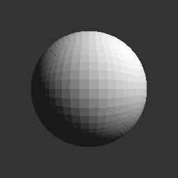

# raycast

Really limited ray-casters.

## Triangles

My original thinking was to start in C and keep it simple enough to express in BASIC or FORTH or another simple language, especially 8-bit.  I've probably gone too far.

The current implementation uses 29 floats per triangle.  An AppleSoft FP triangle (5 bytes per float) would then be 145 bytes, not including the source data.  In 32KB, one could only have 225 triangles.  I wasn't able to find decent triangle models with less than a few thousand triangles.  Perhaps those could fit if meshes were indexed and if the auxiliary data were generated on demand.

Anyway, run it like this:

    triangles < datafile > output.ppm
    
The input file must be a list of 9 whitespace-separated numbers per triangle specifying the X, Y, and Z coordinates of each of 3 vertices per triangle.

The output file will be a 1-component grayscale ASCII pnm, otherwise known as a PGM.

Here's what output of the sample datafiles should look like:

test1.triangles

sphere.triangles

slk.triangles
