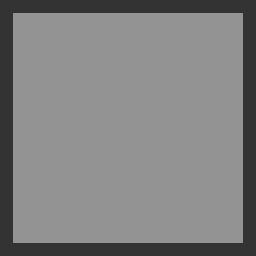

# raycast
Really limited triangle ray-caster.

My original thinking was to start in C and keep it simple enough to express in BASIC or FORTH or another simple language, especially 8-bit.  I've probably gone too far.

Anyway, run it like this:

    raycast < datafile > output.ppm
    
The input file must be a list of triangle vertices, 3 floats each.

The output file will be a 1-component grayscale ASCII pnm, otherwise known as a PGM.

Here's what output of the sample datafiles should look like:

test1.data

sphere.data

slk.data
